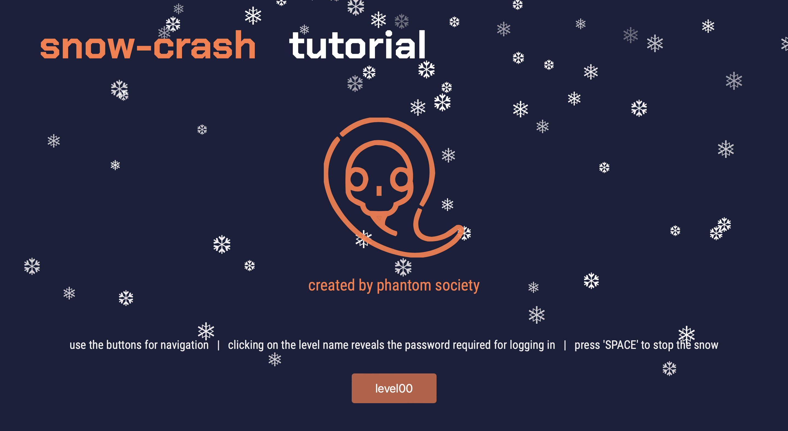

# snow-crash

This project is an introduction to computer security. Snow Crash will make you discover security in various sub-domains, with a developer-oriented approach. You will become familiar with several languages (ASM/perl/php…), develop a certain logic to understand unknown programs, and become aware of problems linked to simple programming errors.

Open <code>level00/resources/index.html</code> to start the tutorial.

    

